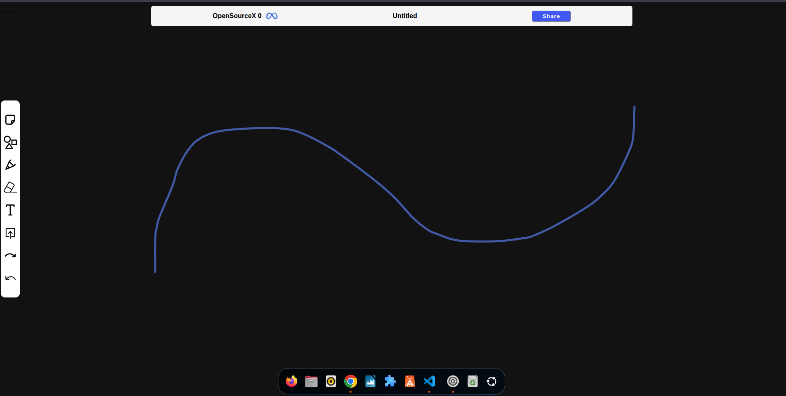
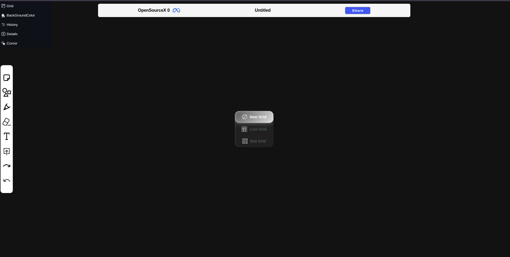
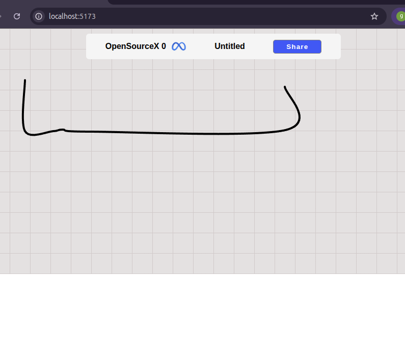
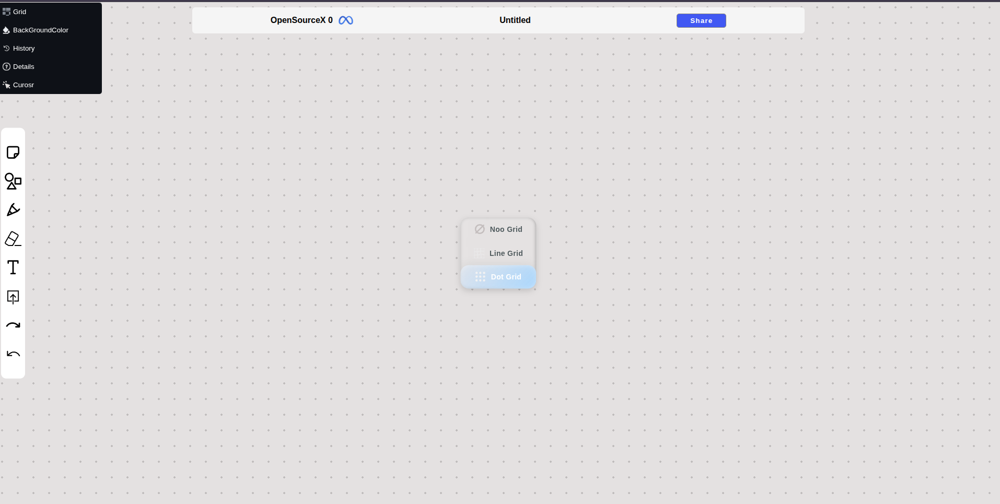
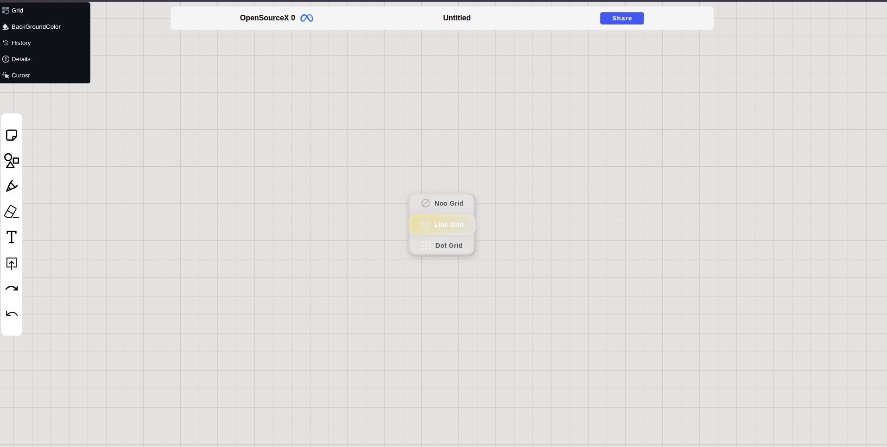
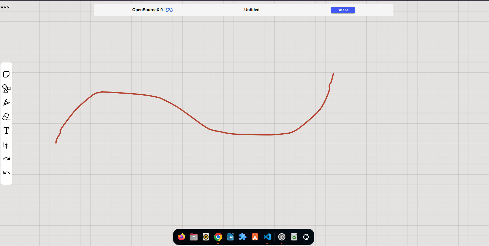

 # 🎨 Drawer App — Turn Ideas into Art
[Watch the FlowDraw demo video](https://res.cloudinary.com/dfmdgsiid/video/upload/v1774754453/show_uj4dj2.mp4)

Welcome to **Drawer App**, a simple yet powerful playground where creativity meets code.
This project is built for anyone who loves sketching, experimenting, and bringing ideas to life—one stroke at a time.

---

## ✨ Why This Project?

Because sometimes, all you need is a blank canvas and a little inspiration.

Drawer App is designed to be:

* ⚡ **Lightweight & fast**
* 🧠 **Easy to understand**
* 🛠️ **Hackable & extendable**

Whether you're a beginner exploring graphics or a developer looking to build something cooler on top—this is your starting point.

---

## 🖼️ Preview

Here’s a glimpse of what you can expect:

</img>
</img>
</img>

</img>
</img>
</img>
 
 <video class="my-video" controls autoplay loop muted>
      <source src="./public/videoshow/show.mp4" type="video/mp4">
    
 </video>

---

## 🚀 Features

* 🎯 Smooth drawing experience
* 🎨 Customizable colors & brush sizes
* 🧼 Clear/reset canvas anytime
* 💾 Ready for saving & exporting (extend it!)
* ⚙️ Built with simplicity in mind

---

## 💡 Built for Developers

This isn't just an app—it's a **foundation**.

You can easily:

* Add layers & advanced tools
* Implement undo/redo functionality
* Export drawings as images or PDFs
* Turn it into a collaborative drawing app
* Integrate AI-assisted drawing features 🤖

---

## 🌍 Open Source & Contribution

This project is **open source**—and that means **you** can shape its future.

Want to improve it? Go ahead:

* Fork it 🍴
* Modify it 🔧
* Break it 💥
* Fix it 🩹
* Share it 🚀

Every contribution matters, whether it's a small fix or a big feature.

---

## 🤝 Let's Build Together

If you’ve got ideas, improvements, or crazy features in mind—don’t keep them to yourself.

Open an issue. Submit a PR. Start a discussion.

Let’s turn this simple drawer into something amazing.

---

## 📌 Final Words

Code is cool.
Creativity is cooler.
But building something together? That’s the best part.

**Start drawing. Start building. Start contributing.**
